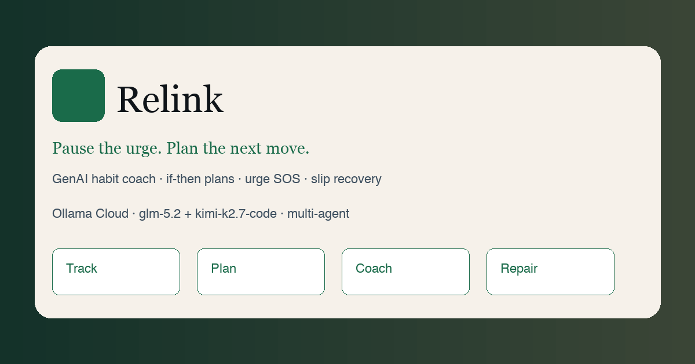

# Relink



**Pause the urge. Plan the next move. Relink who you’re becoming.**

Open-source GenAI web app that helps people reduce harmful habits (screen time, social media, nicotine, alcohol, custom) with intelligent nudges, personalized tracking, adaptive coaching, and shame-free slip recovery.

> Wellness tool — **not** medical care or therapy.

## Features

- Multi-habit onboarding + values/identity profiler
- Daily check-in (mood, urge 0–10, slip flag)
- Implementation Intention Lab (if-then plans)
- Urge SOS guided protocol
- Adaptive MI-style coach chat
- Slip recovery (repairs metric, not toxic streaks)
- Pattern insights + nudges
- Safety classifier + crisis resources (before any LLM)
- **Google ADK** multi-agent graph (optional package)
- **Ollama Cloud** primary (`glm-5.2` coach · `kimi-k2.7-code` structured)
- **Vertex Gemini** automatic fallback on Ollama failure
- Mock mode for offline / CI

## Stack

| Layer | Tech |
|-------|------|
| Web | Next.js 15, TypeScript, Tailwind |
| Coach | FastAPI + ADK agent graph + ModelRouter |
| LLM | Ollama Cloud → Vertex Gemini → mock |
| Deploy | Cloud Run (`gcpdevelopment-464720`) |
| Store | Browser localStorage (Firebase-ready) |

## Quick start

### 1. Coach service

```bash
cd services/coach
python3 -m venv .venv
source .venv/bin/activate
pip install -e ".[dev]"
# optional ADK: pip install -e ".[adk]"
export RELINK_LLM_PROVIDER=mock
uvicorn relink_coach.main:app --port 8787
```

### 2. Web app

```bash
cd apps/web
npm install
export COACH_URL=http://127.0.0.1:8787
npm run dev
```

Open http://localhost:3000

### Ollama Cloud + Vertex fallback

```bash
export OLLAMA_API_KEY=your_key          # https://ollama.com/settings/keys
export OLLAMA_API_BASE=https://ollama.com/v1
export RELINK_LLM_PROVIDER=ollama
export RELINK_MODEL_COACH=glm-5.2
export RELINK_MODEL_STRUCT=kimi-k2.7-code
export RELINK_LLM_FALLBACK=vertex
export RELINK_GEMINI_MODEL=gemini-2.0-flash
export GOOGLE_CLOUD_PROJECT=gcpdevelopment-464720
export GOOGLE_CLOUD_LOCATION=us-central1
# gcloud auth application-default login   # for local Vertex
uvicorn relink_coach.main:app --port 8787
```

Keys stay on the **coach server only** — never in the browser. Never commit `.env`.

### Live E2E

```bash
chmod +x scripts/e2e_coach.sh
COACH_URL=http://127.0.0.1:8787 ./scripts/e2e_coach.sh
```

## Live deployment (Google Cloud Run)

| Service | URL |
|---------|-----|
| **Web** | https://relink-web-kuw4c4fivq-uc.a.run.app |
| **Coach** | https://relink-coach-kuw4c4fivq-uc.a.run.app |
| Health | https://relink-coach-kuw4c4fivq-uc.a.run.app/health |

Project: `gcpdevelopment-464720` · Region: `us-central1`  
Primary LLM: Ollama Cloud · Fallback: Vertex Gemini · Secret: `ollama-api-key`

### Redeploy

```bash
# 1) Store Ollama key in Secret Manager (once)
echo -n 'YOUR_OLLAMA_KEY' | gcloud secrets create ollama-api-key \
  --data-file=- --project=gcpdevelopment-464720
# or: gcloud secrets versions add ollama-api-key --data-file=-

# 2) Deploy both services
chmod +x deploy/deploy.sh
./deploy/deploy.sh
```

See `deploy/deploy.sh` for image build, IAM, and env wiring.

## Tests

```bash
cd services/coach && pytest -q
cd apps/web && npm test
```

## Use cases

### 1. Late-night doomscroll student
**Before:** Unlocks Instagram in bed; Screen Time only shows the damage next morning.  
**After:** Onboards “social media,” gets if-then *phone across the room*, runs Urge SOS at 11pm, logs success.  
**Example:** Urge rated 8 → surf 90s → plan fires → days practiced +1.

### 2. Alcohol-curious adult
**Before:** Shame after a slip → deletes sobriety app.  
**After:** MI coach elicits own reasons; slip recovery updates high-risk map and next-24h plan without identity attack.  
**Example:** Saturday slip → repair logged → new if-then for friend invites.

### 3. Crisis-adjacent message
**Before:** Generic chatbot continues chat unsafely.  
**After:** Safety layer interrupts, shows IASP/emergency resources, freezes coaching advice.  
**Example:** Crisis language → blocked response + ethics page links.

## Why not X?

| Alternative | Why Relink instead |
|-------------|--------------------|
| one sec / Freedom | Friction without adaptive psychology or multi-habit recovery |
| Forest | Gamified focus; weak on urges/addiction repair |
| I Am Sober | Strong streaks/community; little intelligent personalization |
| Raw ChatGPT | No structured tracking loop, mode protocols, or productized safety |
| Woebot | Closed clinical MH focus; not OSS habit platform |

## Architecture

```
Browser (Next.js) → /api/coach BFF → Cloud Run coach
  SafetyGuard (rules) → ADK-mode agents
  ModelRouter: Ollama Cloud → Vertex Gemini → mock
  Models: glm-5.2 (dialogue) · kimi-k2.7-code (JSON)
```

`GET /health` and `GET /v1/agents` expose provider, fallback, and agent graph.

## Ethics

See in-app **Ethics** page. No cure claims. Alcohol/benzo withdrawal needs medical care. Local data export/delete in Settings.

## License

MIT — see [LICENSE](LICENSE).

## Roadmap

See [ROADMAP.md](ROADMAP.md).
